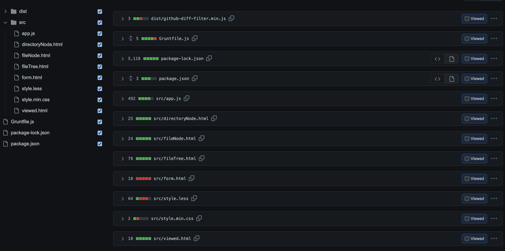
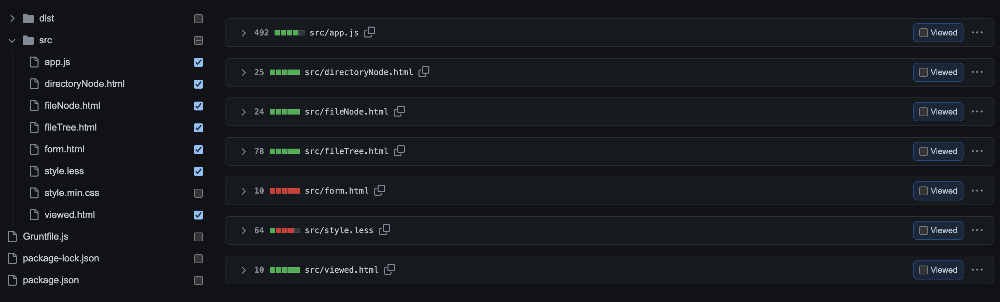

# github-diff-filter

A bookmarklet to allow you to filter the list of files in GitHub's comparison views.

When viewing a commit or comparing two tags with a large number of modified files or lines,
it might be helpful to have the ability to filter that list of files on the fly so that you can:
- review smaller chunks of it at one time
- ignore things that need no review (e.g. reviewing changes for only a single service in a monorepo)

## Getting Started

1. Open up
   [`dist/github-diff-filter.min.js`](https://raw.githubusercontent.com/TheSench/github-diff-filter/master/dist/github-diff-filter.min.js).
2. Copy the entirety of its contents.
3. Create a new bookmark in your browser and paste what you copied
   (and _only_ what you copied) into the URL field.
4. Visit a GitHub comparison page (e.g., use the **/compare** URL for your repository and pick two branches/tags)
   and click the bookmarklet you just created.

   

5. Uncheck the checkbox next to files/directories you wish to hide and watch the chosen files disappear.

   

6. Check the boxes to bring hidden files back.